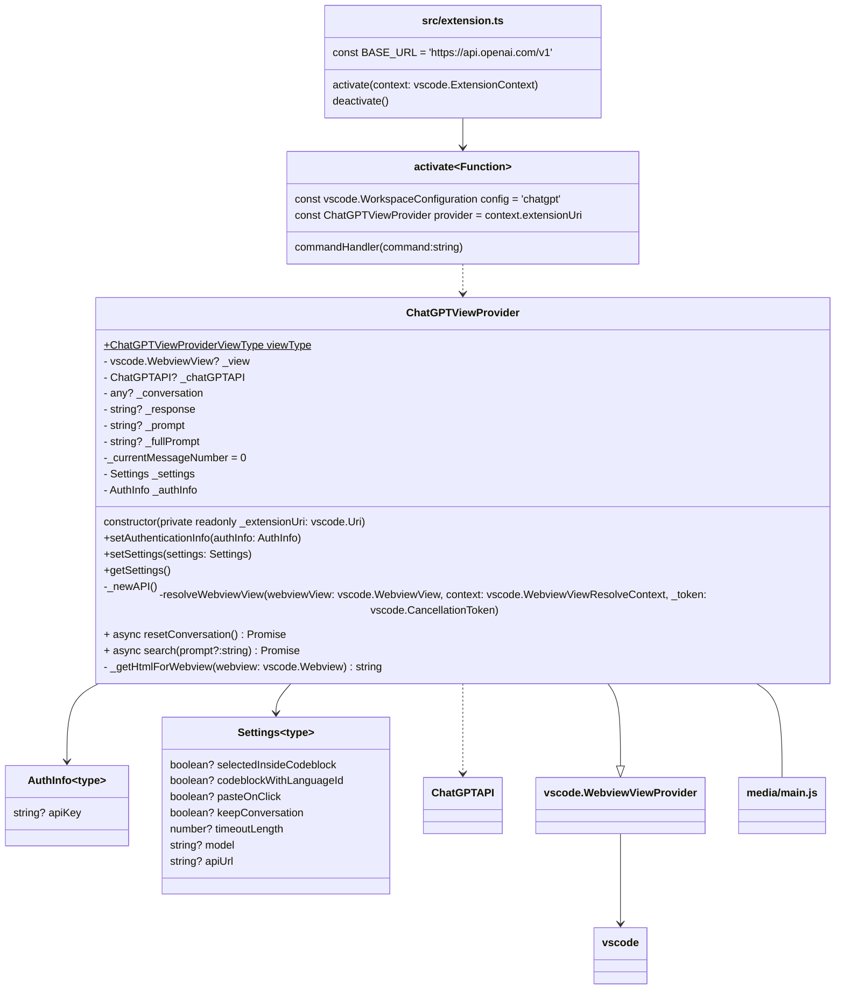
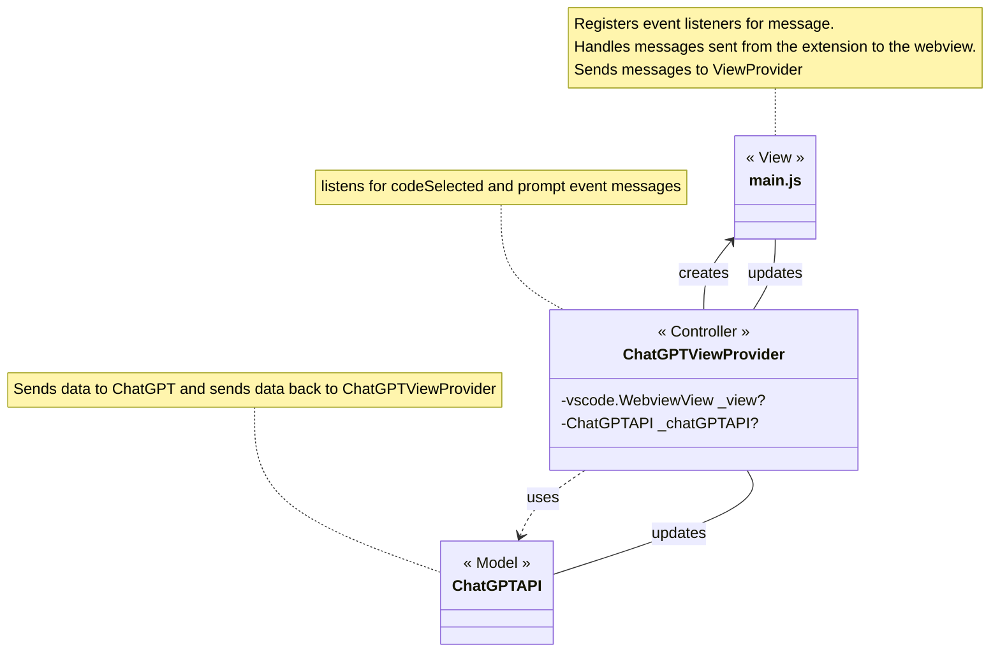
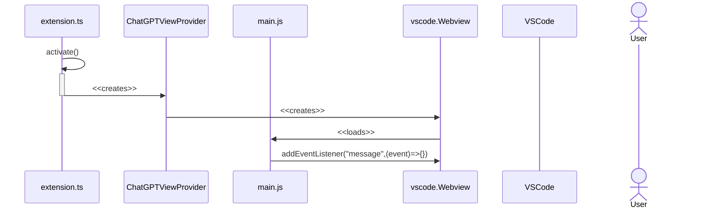

import Figure from "../src/components/Figure";


# System Architecture
The following contains all architecture details on the ReviewBot Software system. These include the code extension's structural and behavioral details. This document can be edited from [`documentation/docs/design.mdx`](https://github.com/Civic-Interactions-Lab/code-review-chatbot-vscode/edit/main/documentation/docs/design.mdx).

## Extension Architecture
:::tip Microsoft's Extension Anatomy Documentation
Go check out Microsoft's [extension anatomy](https://code.visualstudio.com/api/get-started/extension-anatomy) documentation for details on the basic structure and definitions of VSCode Extension written in TypeScript.
:::

The design pattern employed by the extension is MVC (see [Figure 2](#figure-2)). However, it is worth it to highlight that extension.ts `activate()` registers the view provider `ChatGPTViewProvider` as seen in [Figure 1](#figure-1). The provider makes all of the calls to the ChatGPT library from the `search()` function which also updates the `webview` (see [Figure 3](#figure-3) for more details).  The `ChatGPTAPI` acts as the Model, the HTML content acts as the View (with `main.js` sending messages to the controller), and `ChatGPTViewProvider` as the middleman controller to both the View and the API model. Most of the code lives in `src/extension.ts` file such as the `ChatGPTViewProvider` however, the view logic to send messages to the `ChatGPTViewProvider` is within the `media/main.js` JavaScript file.

```text title="Files"
src/
└── extension.ts
media/
├── main.js
└── scripts
    ├── microlight.min.js
    ├── showdown.min.js
    └── tailwind.min.js
```

<Figure id={"figure-1"} caption={"Figure 1. VSCode Extension Structure"} subcaption={"A map of the current structure of the application highlighting inheritance and usage of javascript classes."}>



</Figure>

<Figure id={"figure-2"} caption={"Figure 2. MVC Pattern"} subcaption={"The structure, and how data is passed."}>



</Figure>

<Figure id={"figure-3"} caption={"Figure 3. Extension Lifecycle"} >



</Figure>

